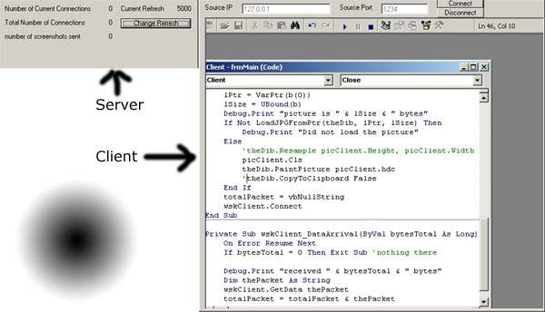



## Streaming Screenshots

### Description

My code sends streaming screenshots over the internet, will work under Win98 and Win2k. Uses the GetDC and cDIBSection API's, req's the Intel Jpeg Library v1.1, freely downloadable from vbaccelerator.com, or get it off my site, http://www.pumkinhed.com/ijl/index.html
 
### More Info
 
Well its two programs actually, the server and the client, so the client needs the server IP and the port. The server needs no configuring, working out some bugs, but feedback is greatly appreciated. Would suggest changing RefreshRate and ServerQuality variables in the server to more acceptable levels, current settings are 5000ms RefreshRate and 90 ServerQuality. None of the server statistics are operational yet, but thats simple enough, as you can see its totally beta, but its done.

Nothing, execute the server, then execute the client, and click connect in the client, voila, works over the internet too.

It returns a screenshot to the client, and if you search through the code for 'CopyToClipboard' and uncomment that line, in both the server and the client, it will save the recorded images to the clipboard.

Well, it has Win2k problems, I avoided them by just using On Error Resume Next which is bad style, but I can't figure out why winsock keeps disconnecting, especially since the IP is local (127.0.0.1, how much more local can i get, lol)

Ok, also, the hdc of the memory copying in the cDIBSection seems to follow the titlebar of the server?? unconfirmed, but tested.

             |
---                |---
**Submitted On**   |2001-04-23 17:53:06
**By**             |[Brandon Gabert](https://github.com/Planet-Source-Code/PSCIndex/blob/master/ByAuthor/brandon-gabert.md)
**Level**          |Intermediate
**User Rating**    |5.0 (20 globes from 4 users)
**Compatibility**  |VB 5\.0, VB 6\.0
**Category**       |[Internet/ HTML](https://github.com/Planet-Source-Code/PSCIndex/blob/master/ByCategory/internet-html__1-34.md)
**World**          |[Visual Basic](https://github.com/Planet-Source-Code/PSCIndex/blob/master/ByWorld/visual-basic.md)
**Archive File**   |[Streaming 187514232001\.zip](https://github.com/Planet-Source-Code/brandon-gabert-streaming-screenshots__1-22642/archive/master.zip)

### API Declarations

yeah, lots of em

